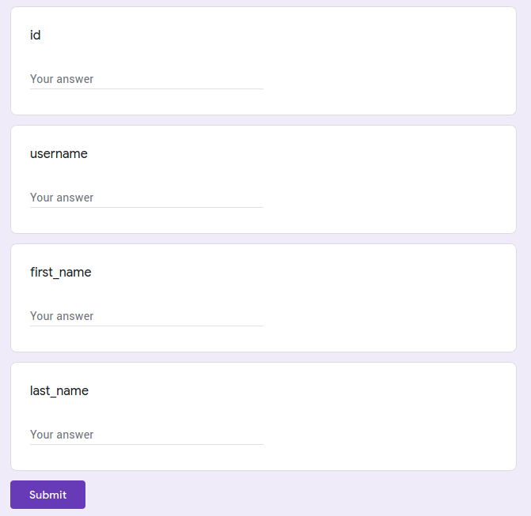

# Google Forms Ruby Gem

When you need to post something to a Google Form from your ruby script.

# Installation

Add to your `Gemfile`:

``` rb
gem 'google_forms'
```

and run `bundle`, or just:

```
gem install google_forms
```

# Usage

Assuming you have [a form](https://forms.gle/5H9R1RPw4oF522wo8) to fill with your script:



**Make sure your fields don't have any validations**

Add the gem to your project:

``` rb
require 'google_forms'
```

Pass a Google Form id or an url (yes, short url will work too):

``` rb
form = GoogleForm.new('https://forms.gle/QvQbSm5Gxg7GNwBq9')

 => #<GoogleForm:12134640 @id=\"1FAIpQLScgwPtuN0aMJ6NLztq2kTZ4pdebxcrE_99Ax6I0fQtBwaT7fA\">
```

Get the list of input fields:

``` rb
form.inputs

 => [#<GoogleFormInput:... @input_type="text", @label="id", @name="entry.462465405">, ...]

form.inputs.map(&:label)

 => ["id", "username", "first_name", "last_name"]
```

Fill in the inputs (using labels):

``` rb
form.id = 12345
form.username = 'installero'
form.first_name = 'Vadim'
form.last_name = 'V'
```

And post the response:

``` rb
form.post
```

Or do it all in one line:

``` rb
form.post(id: 12345, username: 'installero', first_name: 'Vadim', last_name: 'V')
```

Yes, you can combine:

``` rb
form.id = 12345
form.post(username: 'installero', first_name: 'Vadim', last_name: 'V')
```
